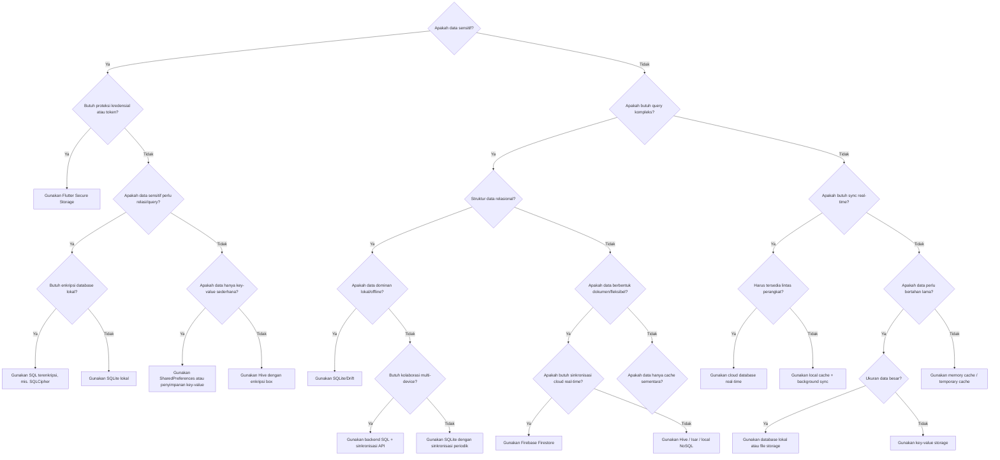
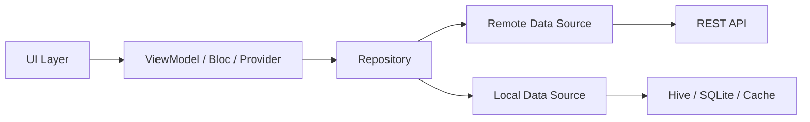

# Algoritma P12 - Audit Keamanan Penyimpanan Data dan Offline Support pada Aplikasi Flutter

## Identitas

**Nama:** shadafi fastiyan  
**NIM:** 23343084  
**Mata Kuliah:** Mobile Programming Lanjutan  
**Pertemuan:** 12  
**Format Nama Dokumen:** `Algoritma_P12_23343084_shadafi fastiyan`

---

## 1. Pohon Keputusan Pemilihan Mekanisme Penyimpanan

Pohon keputusan berikut digunakan untuk memilih mekanisme penyimpanan data pada aplikasi Flutter berdasarkan kebutuhan keamanan, struktur data, sinkronisasi, performa, dan kebutuhan operasional.

### Decision Tree



### Ringkasan Titik Keputusan

Minimal 8 titik keputusan yang digunakan:

1. Apakah data sensitif?
2. Butuh proteksi kredensial atau token?
3. Apakah butuh query kompleks?
4. Data sensitif perlu relasi/query?
5. Butuh enkripsi database lokal?
6. Data hanya key-value sederhana?
7. Struktur data relasional?
8. Data dominan lokal/offline?
9. Butuh kolaborasi multi-device?
10. Data berbentuk dokumen/fleksibel?
11. Butuh sinkronisasi cloud real-time?
12. Data perlu bertahan lama?
13. Ukuran data besar?

---

## 2. Algoritma Audit Keamanan Penyimpanan Data pada Aplikasi Flutter

Audit ini dirancang untuk aplikasi Flutter yang sudah berjalan agar semua mekanisme penyimpanan data dapat diperiksa dari sisi keamanan, sensitivitas data, dan kepatuhan terhadap praktik terbaik.

### Tujuan Audit

- Mengidentifikasi seluruh titik penyimpanan data pada aplikasi.
- Mengelompokkan data berdasarkan sensitivitas.
- Memeriksa apakah mekanisme penyimpanan sudah sesuai.
- Menyusun temuan dan rekomendasi perbaikan.

### Ruang Lingkup Titik Penyimpanan

Titik penyimpanan yang perlu diaudit:

- `SharedPreferences`
- `FlutterSecureStorage`
- `Hive`
- `SQLite` / `sqflite` / `Drift`
- File lokal
- Cache gambar dan API response
- Memory cache
- Log aplikasi
- Crash report / analytics payload
- Cloud storage / backend sinkronisasi

### Klasifikasi Sensitivitas Data

| Kategori Data | Contoh | Sensitivitas | Rekomendasi Mekanisme |
| --- | --- | --- | --- |
| Kredensial | password, refresh token | Sangat Tinggi | Secure Storage |
| Token sesi | access token, session id | Tinggi | Secure Storage |
| Data pribadi | nama, email, nomor HP | Tinggi | DB lokal terenkripsi / backend aman |
| Data transaksi | saldo, mutasi, nominal | Tinggi | DB terenkripsi + proteksi akses |
| Preferensi UI | tema, bahasa | Rendah | SharedPreferences |
| Cache katalog | daftar produk, berita | Rendah-Menengah | Hive / SQLite / cache lokal |
| Log teknis | error stack, request id | Menengah | Sanitasi log, jangan simpan rahasia |

### Algoritma Audit

```text
Mulai audit

1. Inventarisasi semua storage yang dipakai aplikasi
2. Cari seluruh package dan implementasi penyimpanan data
3. Daftar setiap jenis data yang disimpan
4. Untuk setiap data:
   - Tentukan lokasi penyimpanan
   - Tentukan tujuan penyimpanan
   - Klasifikasikan sensitivitasnya
5. Periksa apakah mekanisme yang digunakan sesuai dengan sensitivitas data
6. Periksa apakah data disimpan dalam bentuk plaintext atau terenkripsi
7. Periksa apakah token, password, atau data pribadi masuk ke log
8. Periksa retensi data:
   - Apakah data dihapus saat logout?
   - Apakah cache kadaluarsa?
   - Apakah data lama masih tertinggal?
9. Periksa kontrol akses:
   - Apakah hanya layer repository yang boleh mengakses storage?
   - Apakah ada penyimpanan langsung dari UI?
10. Periksa sinkronisasi cloud:
   - Apakah transport aman (HTTPS/TLS)?
   - Apakah payload sensitif diminimalkan?
11. Catat semua temuan
12. Buat prioritas risiko: kritis, tinggi, sedang, rendah
13. Tulis rekomendasi perbaikan per temuan

Selesai
```

### Checklist Pemeriksaan Mekanisme

| Pemeriksaan | Pertanyaan Audit | Status Ideal |
| --- | --- | --- |
| Lokasi penyimpanan | Data disimpan di mana? | Terdokumentasi |
| Kesesuaian sensitivitas | Data sensitif pakai storage aman? | Sesuai |
| Enkripsi | Data terenkripsi saat disimpan? | Ya |
| Logging | Rahasia tidak tercetak di log? | Ya |
| Retensi | Data lama dihapus saat tidak diperlukan? | Ya |
| Logout cleanup | Token dan cache sensitif dibersihkan? | Ya |
| Layer akses | Akses storage tidak tersebar liar di UI? | Ya |
| Backup risk | Data sensitif aman dari backup tak terenkripsi? | Ya |

### Format Laporan Temuan

| No | Titik Penyimpanan | Data | Risiko | Temuan | Rekomendasi |
| --- | --- | --- | --- | --- | --- |
| 1 | SharedPreferences | access token | Kritis | Token disimpan plaintext | Pindahkan ke FlutterSecureStorage |
| 2 | Hive box `user_cache` | profil user | Tinggi | Data pribadi tanpa enkripsi | Gunakan enkripsi box |
| 3 | Log debug | response API | Tinggi | Payload sensitif tampil di console | Sanitasi logger |
| 4 | Cache gambar | dokumen identitas | Tinggi | File sensitif tersimpan bebas | Gunakan protected storage atau hindari cache |
| 5 | SQLite lokal | transaksi | Sedang | Belum ada kebijakan expiry cache | Tambahkan TTL dan cleanup |

### Contoh Rekomendasi Perbaikan

- Simpan token autentikasi hanya di `FlutterSecureStorage`.
- Enkripsi database lokal bila menyimpan data pribadi atau finansial.
- Pisahkan cache publik dan cache sensitif.
- Hapus seluruh data sensitif saat logout.
- Terapkan TTL untuk cache agar data usang tidak menumpuk.
- Hindari menulis response API lengkap ke log produksi.
- Batasi akses penyimpanan melalui repository atau service layer.

---

## 3. Langkah Menambahkan Offline Support ke Aplikasi Flutter yang Sebelumnya Hanya Online

Offline support memungkinkan aplikasi tetap dapat menampilkan data penting saat internet tidak tersedia serta mengurangi ketergantungan pada server untuk data yang sering diakses.

### Langkah 1 - Identifikasi Data yang Perlu Di-cache

Data yang layak di-cache biasanya:

- Data referensi yang sering dibuka
- Daftar produk, berita, histori, atau profil
- Konfigurasi aplikasi
- Hasil request yang tidak berubah terlalu cepat

Data yang sebaiknya tidak di-cache sembarangan:

- Password
- OTP
- Token dalam storage yang tidak aman
- Data finansial sangat sensitif tanpa enkripsi

### Langkah 2 - Pilih Mekanisme Caching yang Tepat

| Jenis Data | Mekanisme yang Disarankan | Alasan |
| --- | --- | --- |
| Preferensi sederhana | SharedPreferences | Mudah dan ringan |
| Token / rahasia | FlutterSecureStorage | Aman |
| List/objek tanpa query rumit | Hive / Isar | Cepat dan simpel |
| Data relasional / query filter | SQLite / Drift | Query kompleks |
| File / gambar | File cache terkontrol | Efisien untuk media |

### Langkah 3 - Implementasi Repository Pattern dengan Fallback Lokal

Arsitektur yang disarankan:



Prinsip fallback:

- Saat online, ambil data dari API lalu simpan ke cache lokal.
- Saat API gagal atau perangkat offline, baca data dari cache lokal.
- Jika cache kosong, tampilkan state offline atau empty state yang jelas.

### Algoritma Fallback Lokal

```text
Saat aplikasi meminta data

1. Cek koneksi internet
2. Jika online:
   - Ambil data dari API
   - Jika berhasil:
       simpan ke cache lokal
       tampilkan data
   - Jika gagal:
       coba baca cache lokal
       jika cache ada, tampilkan cache
       jika tidak ada, tampilkan error
3. Jika offline:
   - baca cache lokal
   - jika cache ada, tampilkan cache
   - jika tidak ada, tampilkan halaman offline
```

### Contoh Implementasi Repository

```dart
abstract class ArticleRepository {
  Future<List<Article>> getArticles();
}

class ArticleRepositoryImpl implements ArticleRepository {
  final ArticleRemoteDataSource remote;
  final ArticleLocalDataSource local;
  final ConnectivityService connectivity;

  ArticleRepositoryImpl({
    required this.remote,
    required this.local,
    required this.connectivity,
  });

  @override
  Future<List<Article>> getArticles() async {
    final isOnline = await connectivity.isConnected();

    if (isOnline) {
      try {
        final remoteData = await remote.getArticles();
        await local.saveArticles(remoteData);
        return remoteData;
      } catch (_) {
        final cached = await local.getArticles();
        if (cached.isNotEmpty) return cached;
        rethrow;
      }
    }

    final cached = await local.getArticles();
    if (cached.isNotEmpty) return cached;

    throw Exception('Offline dan cache tidak tersedia');
  }
}
```

### Langkah 4 - Tambahkan Metadata Cache

Simpan informasi tambahan:

- waktu terakhir sinkronisasi
- versi data
- TTL atau masa berlaku cache
- status sumber data: `remote` atau `cache`

Contoh:

```text
last_synced_at: 2026-06-06 15:00
source: cache
ttl: 24 jam
```

### Langkah 5 - Testing Skenario Offline

Skenario yang wajib diuji:

1. Online lalu data berhasil disimpan ke cache.
2. Offline tetapi cache tersedia.
3. Offline dan cache kosong.
4. API error 500 lalu fallback ke cache.
5. Timeout lalu fallback ke cache.
6. Logout membersihkan cache sensitif.
7. Cache kadaluarsa ditolak atau diperbarui.

### Matriks Pengujian Offline

| Skenario | Kondisi | Hasil yang Diharapkan |
| --- | --- | --- |
| Sync awal | Online | Data API tampil dan masuk cache |
| Buka ulang tanpa internet | Offline + cache ada | Data cache tampil |
| Pertama kali buka tanpa internet | Offline + cache kosong | Tampil halaman offline |
| Server error | Online + API 500 | Ambil cache bila ada |
| Timeout | Online + lambat | Retry atau fallback cache |
| Logout | User keluar | Data sensitif terhapus |

### Rekomendasi Implementasi

- Gunakan repository sebagai satu pintu akses data.
- Pisahkan local data source dan remote data source.
- Tambahkan indikator UI seperti "Menampilkan data offline".
- Simpan hanya data yang benar-benar berguna untuk mode offline.
- Terapkan invalidasi cache agar data lama tidak menyesatkan pengguna.

---

## Kesimpulan

Pemilihan mekanisme penyimpanan data pada Flutter harus mempertimbangkan sensitivitas data, kebutuhan query, kebutuhan real-time, dan pola penggunaan offline. Audit keamanan membantu memastikan setiap data disimpan dengan mekanisme yang tepat, sementara offline support meningkatkan ketahanan aplikasi saat jaringan bermasalah.

Dengan menggabungkan decision tree, audit keamanan, dan repository pattern dengan fallback lokal, aplikasi Flutter akan menjadi:

- lebih aman
- lebih stabil
- lebih mudah di-maintain
- lebih siap digunakan pada kondisi jaringan tidak ideal
