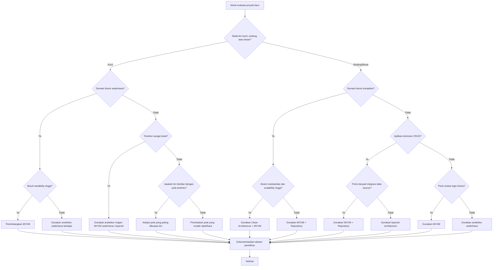
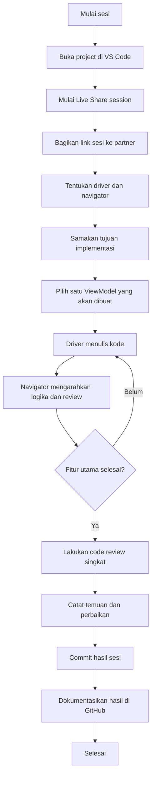
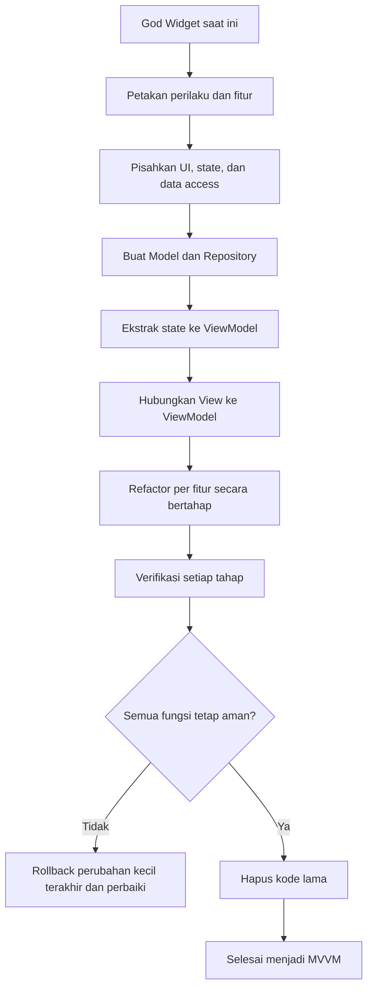

# Algoritma P13 - Evaluasi Arsitektur, Pair Programming Virtual, dan Refactoring Aman ke MVVM

## Identitas

**Nama:** shadafi fastiyan  
**NIM:** 23343084  
**Mata Kuliah:** Mobile Programming Lanjutan  
**Pertemuan:** 13  
**Format Nama Dokumen:** `Algoritma_P13_23343084_shadafi_fastiyan`

---

## 1. Algoritma Evaluasi Arsitektur untuk Proyek Baru

Tujuan evaluasi ini adalah memilih arsitektur yang sesuai untuk proyek baru berdasarkan kondisi tim, kompleksitas bisnis, kebutuhan pengujian, dan tekanan waktu implementasi.

### Flowchart Evaluasi Arsitektur



### Titik Keputusan Utama

1. Identifikasi skala tim.
2. Estimasi kompleksitas domain bisnis.
3. Pertimbangan kebutuhan testability.
4. Evaluasi timeline.
5. Pemeriksaan kebutuhan modularitas dan scalability.
6. Pemeriksaan jenis aplikasi: CRUD atau business-heavy.
7. Pemeriksaan kebutuhan integrasi banyak data source.
8. Pemeriksaan familiaritas tim dengan arsitektur tertentu.
9. Pemilihan arsitektur.
10. Dokumentasi alasan pemilihan.

### Algoritma Evaluasi

```text
Mulai

1. Identifikasi ukuran tim pengembang
2. Analisis domain bisnis:
   - sederhana
   - menengah
   - kompleks
3. Tentukan kebutuhan testability
4. Tinjau timeline proyek
5. Cek kebutuhan modularitas dan scalability
6. Cek jumlah data source dan integrasi eksternal
7. Evaluasi kemampuan tim terhadap pola arsitektur tertentu
8. Pilih arsitektur yang paling seimbang antara kualitas dan kecepatan delivery
9. Dokumentasikan alasan teknis dan nonteknis

Selesai
```

### Contoh Hasil Pemilihan

| Kondisi Proyek | Arsitektur yang Dipilih | Alasan |
| --- | --- | --- |
| Tim kecil, domain sederhana, waktu sempit | Layered / MVVM sederhana | Lebih cepat diimplementasikan |
| Tim sedang, butuh testability, banyak API | MVVM + Repository | Memisahkan UI dan logika data |
| Tim besar, domain kompleks, jangka panjang | Clean Architecture + MVVM | Mudah diskalakan dan diuji |

---

## 2. Urutan Langkah Pair Programming Virtual Menggunakan VS Code Live Share

Pair programming virtual membantu dua developer bekerja pada kode yang sama secara sinkron sambil menjaga komunikasi, fokus, dan kualitas implementasi.

### Alur Sesi Pair Programming



### Langkah-Langkah Sesi

1. Buka proyek di VS Code.
2. Jalankan ekstensi `Live Share`.
3. Buat sesi dan bagikan tautan ke pasangan.
4. Tentukan peran:
   - `Driver`: mengetik dan mengeksekusi perubahan.
   - `Navigator`: mengarahkan desain, mengecek logika, dan memberi masukan.
5. Sepakati target sesi, misalnya membuat satu `ViewModel`.
6. Identifikasi state, event, dan dependency yang dibutuhkan `ViewModel`.
7. Implementasikan `ViewModel` bersama:
   - property state
   - method load data
   - method handle action user
   - error handling
8. Jalankan aplikasi atau test singkat.
9. Lakukan code review cepat bersama.
10. Commit hasil sesi.
11. Dokumentasikan ringkasan sesi di GitHub.

### Contoh Struktur Implementasi Satu ViewModel

```dart
class ProductViewModel extends ChangeNotifier {
  final ProductRepository repository;

  ProductViewModel(this.repository);

  bool isLoading = false;
  String? errorMessage;
  List<Product> products = [];

  Future<void> loadProducts() async {
    isLoading = true;
    errorMessage = null;
    notifyListeners();

    try {
      products = await repository.getProducts();
    } catch (e) {
      errorMessage = e.toString();
    } finally {
      isLoading = false;
      notifyListeners();
    }
  }
}
```

### Hal yang Didokumentasikan di GitHub

- tujuan sesi pair programming
- nama driver dan navigator
- file yang diubah
- `ViewModel` yang diimplementasikan
- temuan saat review singkat
- keputusan teknis yang diambil

### Contoh Ringkasan Dokumentasi

```text
Sesi Pair Programming
- Driver: Developer A
- Navigator: Developer B
- Target: Implementasi ProductViewModel
- Hasil: loadProducts, error handling, loading state
- Review: menyederhanakan state dan memindahkan akses data ke repository
```

---

## 3. Prosedur Refactoring Aman dari God Widget ke MVVM

God Widget adalah widget yang menampung terlalu banyak tanggung jawab sekaligus, seperti UI, state, validasi, networking, transformasi data, dan side effect. Refactoring ke MVVM harus dilakukan secara bertahap agar fungsionalitas lama tetap aman.

### Prinsip Refactoring Aman

- lakukan perubahan kecil bertahap
- hindari rewrite total sekaligus
- pastikan perilaku lama tetap bisa diverifikasi
- pindahkan logika sedikit demi sedikit
- gunakan test atau verifikasi manual di setiap tahap

### Langkah-Langkah Refactoring

#### Langkah 1 - Bekukan Perilaku yang Sudah Ada

Tujuan:

- memahami fitur saat ini
- mencegah perubahan perilaku tak sengaja

Aktivitas:

- identifikasi semua fungsi pada God Widget
- catat input, output, state, dan side effect
- buat checklist perilaku yang harus tetap sama

Risiko:

- ada perilaku tersembunyi yang tidak terdokumentasi

Mitigasi:

- lakukan exploratory testing
- minta konfirmasi alur dari pemilik fitur bila perlu

#### Langkah 2 - Pisahkan Tanggung Jawab

Tujuan:

- membedakan mana kode UI, mana business logic, mana data access

Aktivitas:

- tandai bagian build UI
- tandai state lokal
- tandai pemanggilan API / database
- tandai validasi, mapping, dan formatting

Risiko:

- salah klasifikasi sehingga kode terpecah tidak konsisten

Mitigasi:

- gunakan kategori:
  - View
  - ViewModel
  - Repository
  - Model

#### Langkah 3 - Buat Model dan Repository Jika Belum Ada

Tujuan:

- memindahkan akses data keluar dari widget

Aktivitas:

- buat entity/model data
- buat repository interface
- buat implementasi repository

Risiko:

- kontrak repository belum lengkap

Mitigasi:

- mulai dari use case paling kecil yang aktif dipakai widget

#### Langkah 4 - Ekstrak State ke ViewModel

Tujuan:

- memindahkan state dan logika presentasi dari widget ke class terpisah

Aktivitas:

- buat `ViewModel`
- pindahkan loading state
- pindahkan error state
- pindahkan method aksi user
- hubungkan repository ke `ViewModel`

Risiko:

- sinkronisasi state menjadi kacau

Mitigasi:

- pindahkan satu kelompok state dalam satu waktu
- verifikasi UI setelah setiap pemindahan

#### Langkah 5 - Hubungkan View ke ViewModel

Tujuan:

- membuat widget hanya fokus menampilkan state dan meneruskan interaksi user

Aktivitas:

- ubah widget agar membaca state dari `ViewModel`
- panggil method `ViewModel` untuk event user
- kurangi logika di dalam `build()`

Risiko:

- rebuild berlebihan atau state tidak ter-update

Mitigasi:

- pilih mekanisme state management yang konsisten
- uji loading, success, dan error state

#### Langkah 6 - Refactor Bertahap Per Fitur

Tujuan:

- menghindari refactor besar yang berisiko tinggi

Aktivitas:

- mulai dari satu alur, misalnya `load data`
- lanjut ke `submit form`
- lanjut ke `refresh`
- lanjut ke `delete/update`

Risiko:

- sebagian kode lama dan baru hidup bersamaan terlalu lama

Mitigasi:

- tandai area transisi
- hapus kode lama segera setelah penggantinya stabil

#### Langkah 7 - Lakukan Verifikasi Fungsional

Tujuan:

- memastikan tidak ada regresi

Aktivitas:

- uji skenario sukses
- uji skenario error
- uji empty state
- uji loading
- uji input user

Risiko:

- regresi muncul di jalur yang jarang dipakai

Mitigasi:

- buat smoke test dan regression checklist

#### Langkah 8 - Bersihkan Kode Lama

Tujuan:

- menghilangkan duplikasi dan jejak God Widget

Aktivitas:

- hapus function yang sudah dipindah
- hapus dependency yang tidak lagi dipakai
- rapikan nama class dan file

Risiko:

- ada referensi lama yang masih dipakai tersembunyi

Mitigasi:

- gunakan search global sebelum delete
- jalankan build dan test akhir

### Diagram Refactoring Aman



### Risiko Umum dan Penanganannya

| Risiko | Dampak | Mitigasi |
| --- | --- | --- |
| Regresi fitur | Fungsi lama rusak | Test per tahap |
| State tidak sinkron | UI menampilkan data salah | Validasi state flow |
| Logic tercecer | Sulit di-maintain | Tentukan boundary ViewModel/Repository |
| Refactor terlalu besar | Sulit rollback | Pecah jadi commit kecil |
| Kode duplikat sementara | Membingungkan tim | Bersihkan segera setelah stabil |

### Hasil Akhir yang Diharapkan

Setelah refactoring:

- `View` fokus pada tampilan
- `ViewModel` mengelola state dan logika presentasi
- `Repository` menangani sumber data
- kode lebih mudah diuji
- perubahan fitur lebih aman dilakukan

---

## Kesimpulan

Evaluasi arsitektur yang baik membantu tim memilih pola yang sesuai dengan ukuran tim, kompleksitas domain, kebutuhan testability, dan batas waktu proyek. Pair programming virtual dengan VS Code Live Share dapat meningkatkan kualitas implementasi dan transfer pengetahuan. Sementara itu, refactoring aman dari God Widget ke MVVM harus dilakukan bertahap, terukur, dan selalu divalidasi agar fungsionalitas yang sudah ada tidak rusak.
