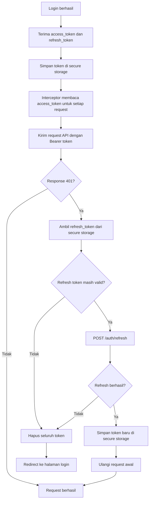

# Algoritma P14 - Checklist Pra-Rilis, Alur Token Aman, dan Security Audit Flutter

## Identitas

**Nama:** shadafi Fastiyan  
**NIM:** 23343084  
**Mata Kuliah:** Mobile Programming Lanjutan  
**Pertemuan:** 14  
**Format Nama Dokumen:** `Algoritma_P14_23343084_shadafiFastiyan`

---

## 1. Checklist Keamanan Pra-Rilis untuk Aplikasi Flutter

Checklist ini dipakai sebelum aplikasi dirilis ke pengguna agar risiko keamanan dasar tidak lolos ke produksi.

### Checklist Utama

| Area | Item Checklist | Langkah Verifikasi |
| --- | --- | --- |
| Dependencies | Audit package Flutter dan native dependency | Jalankan `flutter pub outdated`, cek changelog security, pastikan tidak ada package usang kritis |
| Dependencies | Hapus package yang tidak dipakai | Cocokkan `pubspec.yaml` dengan import aktual di kode |
| Android config | Periksa `AndroidManifest.xml` | Pastikan permission minimal, `android:usesCleartextTraffic="false"` jika memungkinkan, dan activity sensitif tidak diexport tanpa alasan |
| iOS config | Periksa `Info.plist` | Pastikan ATS aktif, permission description relevan, dan tidak ada entri debug tertinggal |
| Secure storage | Verifikasi token tidak disimpan di storage biasa | Cari `SharedPreferences`, `Hive`, dan log untuk memastikan token tidak disimpan plaintext |
| Secure storage | Verifikasi data sensitif dibersihkan saat logout | Uji logout lalu cek data sesi tidak bisa dipakai lagi |
| Network | Uji certificate pinning | Simulasikan koneksi melalui proxy debug atau sertifikat tak dikenal dan pastikan request ditolak |
| Network | Pastikan semua endpoint penting memakai HTTPS | Review base URL, build config, dan request runtime |
| Logging | Sanitasi log | Cari `print`, logger, dan interceptor agar token/password tidak tercetak |
| Build hardening | Aktifkan obfuscation | Build release dengan `--obfuscate --split-debug-info` dan simpan simbol debug terpisah |
| Build hardening | Pastikan mode release yang diuji | Jalankan build release, bukan debug, untuk verifikasi final |
| Secrets | Cek secret di source code | Cari API key, token, dan endpoint sensitif yang hardcoded |
| Storage | Audit cache lokal | Pastikan cache sensitif terenkripsi atau tidak disimpan |
| Error handling | Review penanganan 401/403/500 | Uji flow token expired dan kegagalan refresh |
| Review final | Lakukan smoke test keamanan | Login, logout, offline, reinstall, dan relaunch untuk memastikan perilaku aman |

### Detail Verifikasi Item Wajib

#### Audit Dependencies

Langkah:

1. Jalankan audit versi package.
2. Tandai package yang deprecated atau lama.
3. Baca release note untuk patch keamanan.
4. Pastikan package kritis seperti networking, auth, dan storage dalam versi aman.

Verifikasi berhasil jika:

- tidak ada dependency kritis usang
- tidak ada package abandoned tanpa alasan kuat

#### Pemeriksaan AndroidManifest / Info.plist

Langkah:

1. Review seluruh permission yang diminta.
2. Hapus permission yang tidak benar-benar dipakai.
3. Cek kebijakan cleartext traffic.
4. Pastikan deskripsi permission iOS sesuai kebutuhan fitur.

Verifikasi berhasil jika:

- permission minimal
- tidak ada konfigurasi debug yang bocor ke release

#### Verifikasi Secure Storage

Langkah:

1. Cari tempat penyimpanan token di kode.
2. Pastikan token dan refresh token hanya masuk `flutter_secure_storage`.
3. Cek proses logout dan token refresh.
4. Pastikan data sensitif tidak disalin ke cache lain.

Verifikasi berhasil jika:

- token tidak ditemukan di storage biasa
- token hilang setelah logout

#### Pengujian Certificate Pinning

Langkah:

1. Jalankan aplikasi pada environment uji.
2. Arahkan traffic ke proxy/sertifikat yang tidak sesuai.
3. Pastikan request gagal saat pin tidak cocok.
4. Uji juga koneksi normal agar tidak ada false reject.

Verifikasi berhasil jika:

- koneksi dengan sertifikat salah ditolak
- koneksi dengan sertifikat sah tetap berhasil

#### Aktivasi Code Obfuscation

Langkah:

1. Build aplikasi dengan flag obfuscation.
2. Simpan output `split-debug-info`.
3. Pastikan pipeline release memakai build hardened.
4. Uji aplikasi hasil release.

Verifikasi berhasil jika:

- build release sukses
- simbol debug terpisah tersimpan aman

---

## 2. Flowchart Alur Penanganan Token yang Aman



### Algoritma Penanganan Token

```text
Saat login berhasil:
1. Terima access_token dan refresh_token
2. Simpan token di secure storage
3. Gunakan access_token pada setiap request API

Saat request gagal dengan HTTP 401:
4. Ambil refresh_token
5. Jika refresh token valid:
   - kirim request refresh
   - simpan token baru
   - ulangi request awal
6. Jika refresh gagal atau refresh token expired:
   - hapus seluruh token
   - reset state sesi
   - arahkan user ke halaman login
```

### Prinsip Keamanan Flow Token

- `access_token` berumur pendek.
- `refresh_token` hanya disimpan di secure storage.
- Refresh token tidak boleh di-log.
- Saat refresh gagal, sesi harus benar-benar diputus.
- Request retry hanya dilakukan setelah token baru berhasil disimpan.

---

## 3. Prosedur Security Audit Sederhana untuk Review Kode Flutter Teman

Tujuan prosedur ini adalah membantu melakukan review keamanan yang ringan namun tetap berguna dan konstruktif.

### Langkah Pertama Saat Mereview

1. Pahami konteks aplikasi:
   - jenis data yang dikelola
   - apakah ada login
   - apakah ada pembayaran, profil, atau data sensitif
2. Lihat struktur proyek:
   - `pubspec.yaml`
   - layer networking
   - storage
   - auth flow
3. Tentukan area berisiko tinggi lebih dulu:
   - auth
   - token
   - storage
   - API
   - logging

### Cara Mengidentifikasi Anti-Pattern Keamanan

Cari pola-pola berikut:

- token disimpan di `SharedPreferences`
- password atau PIN disimpan lokal
- base URL `http://` untuk endpoint sensitif
- tidak ada penanganan 401 yang benar
- request/response sensitif dicetak ke log
- secret hardcoded di source code
- permission berlebihan di Android/iOS config
- tidak ada cleanup data saat logout
- interceptor menambah header auth secara tidak konsisten
- cache lokal menyimpan data sensitif tanpa proteksi

### Cara Memberikan Komentar Konstruktif di GitHub

Gunakan format komentar yang sopan, jelas, dan bisa ditindaklanjuti.

Contoh:

```text
Temuan:
Access token saat ini masih disimpan di SharedPreferences.

Risiko:
Token lebih mudah diakses jika device compromise atau backup tidak aman.

Saran:
Pindahkan penyimpanan token ke flutter_secure_storage dan pastikan data dibersihkan saat logout.
```

Prinsip komentar:

- fokus pada risiko, bukan orangnya
- jelaskan dampak teknis
- beri saran perbaikan spesifik
- hindari komentar yang hanya bilang "kurang aman" tanpa detail

### Cara Mendokumentasikan Temuan Audit

Gunakan tabel sederhana agar hasil review mudah dibaca.

| No | Lokasi | Temuan | Risiko | Prioritas | Rekomendasi |
| --- | --- | --- | --- | --- | --- |
| 1 | `auth_service.dart` | Token disimpan di storage biasa | Tinggi | P1 | Gunakan secure storage |
| 2 | `dio_client.dart` | Log response sensitif aktif | Sedang | P2 | Masking atau nonaktifkan di release |
| 3 | `AndroidManifest.xml` | Permission tidak perlu masih aktif | Rendah | P3 | Hapus permission |

### Algoritma Audit Ringkas

```text
Mulai review

1. Pahami fungsi aplikasi
2. Tinjau dependency dan package sensitif
3. Review auth flow
4. Review penyimpanan data
5. Review network layer
6. Review logging dan error handling
7. Review konfigurasi platform
8. Catat anti-pattern
9. Beri komentar konstruktif di GitHub
10. Rangkum temuan berdasarkan prioritas

Selesai
```

### Keluaran Audit yang Diharapkan

- daftar temuan yang jelas
- prioritas risiko
- rekomendasi yang bisa langsung dikerjakan
- catatan area yang sudah aman

---

## Kesimpulan

Checklist pra-rilis membantu memastikan aplikasi Flutter siap dipublikasikan dengan kontrol keamanan minimum yang layak. Flow token yang aman mencegah sesi bocor atau terus berjalan setelah token kadaluarsa. Di sisi lain, security audit sederhana yang dilakukan dengan cara yang konstruktif bisa sangat membantu teman satu tim memperbaiki kode tanpa membuat proses review terasa menghakimi.
