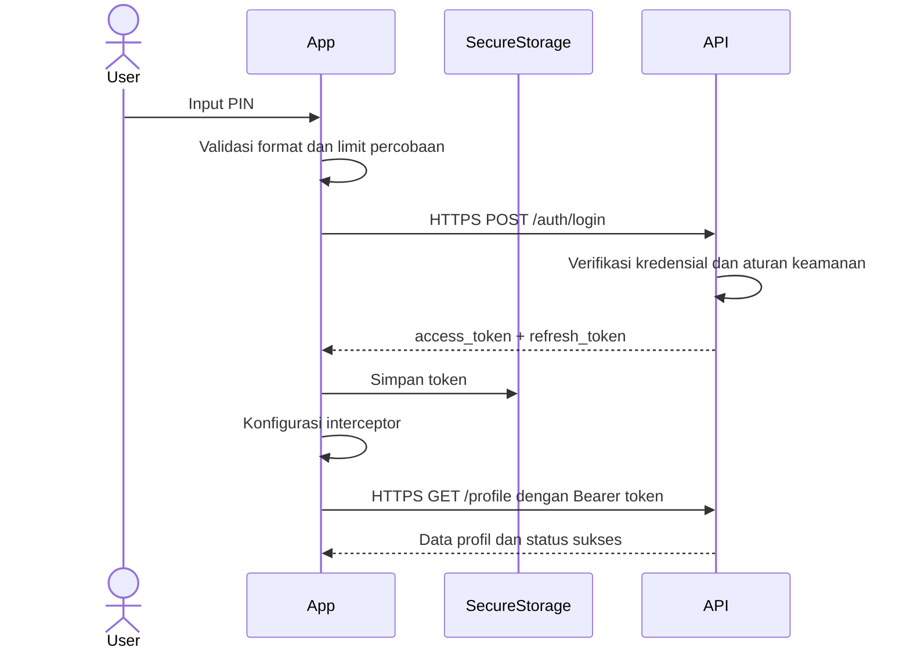

# Dekomposisi P14 - Keamanan Aplikasi Mobile

## Identitas

**Nama:** shadafi fasityan  
**NIM:** 23343084  
**Mata Kuliah:** Mobile Programming Lanjutan  
**Pertemuan:** 14  
**Format Nama Dokumen:** `Dekomposisi_P14_23343084_shadafi fasityan`

---

## 1. Dekomposisi Topik "Keamanan Aplikasi Mobile"

Topik keamanan aplikasi mobile dapat dipecah menjadi beberapa domain agar proses belajar, audit, dan implementasi mitigasi lebih terarah.

### Domain 1 - Authentication dan Session Security

| Aspek | Uraian |
| --- | --- |
| Nama domain | Authentication dan Session Security |
| Ancaman utama | PIN lemah, brute force, credential stuffing, session hijacking, token theft |
| Mekanisme mitigasi | PIN policy, biometrik, MFA, rate limiting, session timeout, refresh token rotation |
| Tools/package Flutter | `local_auth`, `flutter_secure_storage`, `dio`, `jwt_decoder` |

### Domain 2 - Data Storage dan Secret Protection

| Aspek | Uraian |
| --- | --- |
| Nama domain | Data Storage dan Secret Protection |
| Ancaman utama | Token disimpan plaintext, kebocoran PII, data sensitif masuk cache, backup tidak aman |
| Mekanisme mitigasi | Secure storage, enkripsi database, minimisasi data lokal, logout cleanup, TTL cache |
| Tools/package Flutter | `flutter_secure_storage`, `hive`, `sqflite`, `isar`, `cryptography` |

### Domain 3 - Network dan API Communication Security

| Aspek | Uraian |
| --- | --- |
| Nama domain | Network dan API Communication Security |
| Ancaman utama | Man-in-the-middle, replay attack, API sniffing, insecure TLS, token interception |
| Mekanisme mitigasi | HTTPS only, certificate pinning, signed request, short-lived token, retry policy aman |
| Tools/package Flutter | `dio`, `http`, `pretty_dio_logger` (non-produksi), custom `HttpClient`, `connectivity_plus` |

### Domain 4 - Authorization dan Access Control

| Aspek | Uraian |
| --- | --- |
| Nama domain | Authorization dan Access Control |
| Ancaman utama | Broken access control, privilege escalation, endpoint tidak dibatasi role |
| Mekanisme mitigasi | Role-based access control, server-side authorization, scoped token, audit trail |
| Tools/package Flutter | `dio`, `provider`, `riverpod`, `flutter_bloc` |

### Domain 5 - App Hardening dan Reverse Engineering Protection

| Aspek | Uraian |
| --- | --- |
| Nama domain | App Hardening dan Reverse Engineering Protection |
| Ancaman utama | APK decompilation, secret extraction, tampering, repackaging |
| Mekanisme mitigasi | Code obfuscation, secret tidak di-bundle, root/jailbreak detection, integrity checks |
| Tools/package Flutter | Flutter obfuscation build flags, `flutter_jailbreak_detection`, `device_info_plus` |

### Domain 6 - Privacy, Logging, dan Monitoring

| Aspek | Uraian |
| --- | --- |
| Nama domain | Privacy, Logging, dan Monitoring |
| Ancaman utama | Data sensitif muncul di log, analytics berlebihan, crash report bocor, debug artifact tertinggal |
| Mekanisme mitigasi | Log sanitization, data masking, log level produksi, consent privacy, audit event |
| Tools/package Flutter | `logger`, `talker`, `firebase_crashlytics`, `sentry_flutter` |

### Ringkasan Domain

| No | Domain | Fokus Inti |
| --- | --- | --- |
| 1 | Authentication dan Session Security | Identitas user dan sesi login |
| 2 | Data Storage dan Secret Protection | Proteksi token dan data lokal |
| 3 | Network dan API Communication Security | Keamanan komunikasi client-server |
| 4 | Authorization dan Access Control | Hak akses setelah login |
| 5 | App Hardening dan Reverse Engineering Protection | Ketahanan aplikasi terhadap pembongkaran |
| 6 | Privacy, Logging, dan Monitoring | Pengelolaan data observabilitas yang aman |

---

## 2. Skenario Teknis Keamanan: Pengguna Login ke Aplikasi Perbankan Mobile

Berikut uraian teknis dari sisi keamanan mulai dari user memasukkan PIN sampai request API pertama berhasil.

### Urutan Langkah Teknis

1. Pengguna membuka aplikasi dan halaman login memeriksa apakah device masih memiliki sesi aktif yang valid.
2. Pengguna memasukkan PIN atau kredensial, lalu input divalidasi lokal agar format salah langsung ditolak.
3. Aplikasi membatasi jumlah percobaan PIN untuk mencegah brute force dan dapat menambahkan cooldown.
4. Jika biometrik aktif, aplikasi dapat meminta verifikasi tambahan melalui `local_auth`.
5. Kredensial dikirim ke backend hanya melalui koneksi HTTPS dengan TLS yang valid.
6. Client menambahkan metadata perangkat yang aman dan seperlunya, misalnya device id non-sensitif atau app version.
7. Backend memverifikasi kredensial, status akun, device trust, dan rule keamanan lain seperti rate limit.
8. Jika autentikasi berhasil, backend mengembalikan `access_token` dan `refresh_token` dengan masa berlaku terbatas.
9. Aplikasi menyimpan token hanya di `flutter_secure_storage`, bukan di `SharedPreferences`.
10. Aplikasi membersihkan data sesi lama untuk mencegah token lama tetap bisa dipakai.
11. Interceptor HTTP dikonfigurasi agar otomatis membaca `access_token` dari secure storage pada setiap request.
12. Aplikasi melakukan request pertama yang memerlukan autentikasi, misalnya `GET /profile` atau `GET /account/summary`.
13. Header `Authorization: Bearer <access_token>` dikirim bersama request pertama.
14. Backend memverifikasi signature token, expiry, issuer, audience, dan scope yang diizinkan.
15. Jika token valid, backend mengembalikan data awal pengguna dan aplikasi menandai sesi sebagai berhasil masuk.

### Diagram Ringkas Alur Login Aman

### Kontrol Keamanan yang Perlu Diperhatikan

- PIN tidak boleh disimpan plaintext.
- Token harus memiliki expiry pendek untuk `access_token`.
- `refresh_token` harus diproteksi lebih ketat daripada data biasa.
- Tidak boleh ada token lengkap yang tercetak di log.
- Retry login harus dibatasi agar tidak jadi celah brute force.

---

## 3. Sub-topik Keamanan Mobile yang Perlu Dipelajari Lebih Lanjut

### Wajib Dikuasai Segera

- Authentication dasar: login, logout, session timeout
- Secure storage untuk token dan secret
- HTTPS dan validasi TLS
- Permission handling yang minimal
- Logging aman dan masking data sensitif
- Dasar OWASP Mobile Top 10
- State management yang tidak membocorkan data sensitif ke UI/log

### Penting untuk Produksi

- Certificate pinning
- Refresh token flow yang aman
- Offline cache dan enkripsi database lokal
- Root/jailbreak detection
- Code obfuscation dan pengelolaan secret build
- Dependency audit dan patching library rentan
- Keamanan deep link dan intent handling
- Privasi analytics, crash reporting, dan data retention

### Lanjutan untuk Spesialis Keamanan

- Reverse engineering APK/IPA dan mitigasinya
- Mobile runtime tampering detection
- Threat modeling untuk aplikasi mobile
- Secure SDLC dan security gate CI/CD
- Advanced key management dan hardware-backed keystore
- API abuse detection dan anomaly detection
- RASP, integrity attestation, dan anti-repackaging
- Forensic logging dan incident response untuk mobile apps

### Prioritas Belajar Profesional

| Level | Fokus |
| --- | --- |
| Segera | Lindungi autentikasi, token, storage, dan network |
| Produksi | Kuatkan hardening, dependency audit, dan operational security |
| Spesialis | Perdalam threat modeling, attestation, dan defense tingkat lanjut |

---

## Kesimpulan

Keamanan aplikasi mobile tidak cukup dipandang sebagai satu topik besar. Dengan memecahnya ke dalam domain-domain yang jelas, tim bisa lebih mudah menentukan ancaman utama, memilih mitigasi yang tepat, dan menetapkan tools Flutter yang relevan. Skenario login perbankan juga menunjukkan bahwa keamanan terjadi di setiap langkah, bukan hanya saat user memasukkan PIN.
