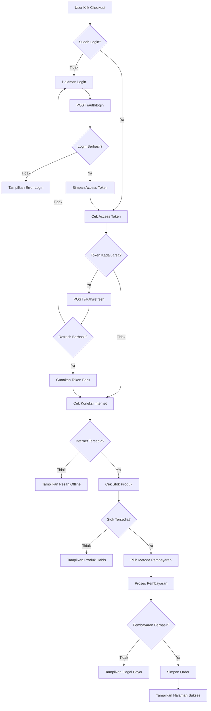
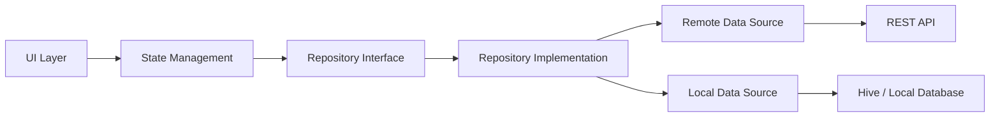

# 🚀 Algoritma P11 - Strategi dan Pola Integrasi REST API pada Aplikasi Mobile

## 👨‍🎓 Identitas

**Nama:** (Isi Nama Lengkap)  
**NIM:** (Isi NIM)  
**Mata Kuliah:** Mobile Programming Lanjutan  
**Pertemuan:** 11  
**Topik:** Strategi dan Pola Integrasi REST API pada Aplikasi Mobile Skala Produksi

---

# 📌 Tugas 1 - Flowchart Checkout di Aplikasi E-Commerce

## Flowchart Checkout



---

# 📌 Tugas 2 - Algoritma Penanganan Error

## A. Tidak Ada Koneksi Internet

| Komponen | Deskripsi |
| --- | --- |
| Kondisi | Perangkat tidak terhubung internet |
| Deteksi | `connectivity_plus` |
| Tindakan Aplikasi | Menggunakan data cache jika tersedia |
| Tampilan UI | Banner "Anda sedang offline" |
| Solusi | Tombol Coba Lagi |

### Algoritma

```text
Jika internet tidak tersedia
    Tampilkan status offline
    Cek cache lokal
    Jika cache tersedia
        Tampilkan data cache
    Jika tidak tersedia
        Tampilkan halaman offline
```

---

## B. Server Error (HTTP 500)

| Komponen | Deskripsi |
| --- | --- |
| Kondisi | Server mengalami gangguan |
| Deteksi | HTTP Status Code 500 |
| Tindakan Aplikasi | Retry otomatis |
| Tampilan UI | "Terjadi gangguan pada server" |
| Solusi | Exponential Backoff |

### Algoritma

```text
Jika response 500
    Retry 3 kali
    Tunggu 1 detik
    Tunggu 2 detik
    Tunggu 4 detik

Jika masih gagal
    Tampilkan pesan server error
```

---

## C. Request Timeout

| Komponen | Deskripsi |
| --- | --- |
| Kondisi | Server terlalu lama merespon |
| Deteksi | Dio Timeout Exception |
| Tindakan Aplikasi | Hentikan request |
| Tampilan UI | "Koneksi terlalu lambat" |
| Solusi | Tombol Retry |

### Algoritma

```text
Jika request melebihi timeout
    Batalkan request
    Tampilkan pesan timeout
    Berikan tombol coba lagi
```

---

## D. Token Kadaluarsa (HTTP 401)

| Komponen | Deskripsi |
| --- | --- |
| Kondisi | Access Token sudah expired |
| Deteksi | HTTP 401 Unauthorized |
| Tindakan Aplikasi | Refresh Token |
| Tampilan UI | Tidak terlihat oleh pengguna |
| Solusi | Login ulang jika refresh gagal |

### Algoritma

```text
Jika response 401
    Ambil refresh token

    Jika refresh token valid
        Minta access token baru
        Simpan token baru
        Ulangi request

    Jika refresh gagal
        Hapus seluruh token
        Redirect ke halaman login
```

---

## E. Format Data Tidak Sesuai

| Komponen | Deskripsi |
| --- | --- |
| Kondisi | JSON tidak sesuai model |
| Deteksi | FormatException |
| Tindakan Aplikasi | Logging Error |
| Tampilan UI | "Data tidak dapat dimuat" |
| Solusi | Fallback Response |

### Algoritma

```text
Jika parsing JSON gagal
    Simpan log error
    Tampilkan pesan umum
    Jangan crash aplikasi
```

---

# 📌 Tugas 3 - Implementasi Repository Pattern dari Nol

## Diagram Repository Pattern



---

## Langkah 1 - Membuat Abstract Repository

Tujuan:

- Membuat kontrak operasi data.

Contoh:

```dart
abstract class ProductRepository {
  Future<List<Product>> getProducts();
}
```

---

## Langkah 2 - Membuat Remote Data Source

Tujuan:

- Mengambil data dari REST API.

Contoh:

```dart
class ProductRemoteDataSource {
  Future<List<Product>> getProducts() async {
    final response = await dio.get('/products');
    return Product.fromList(response.data);
  }
}
```

---

## Langkah 3 - Membuat Local Data Source

Tujuan:

- Menyimpan cache lokal.

Contoh:

```dart
class ProductLocalDataSource {
  Future<void> cacheProducts(List<Product> products);
  Future<List<Product>?> getCachedProducts();
}
```

---

## Langkah 4 - Membuat Repository Implementation

Tujuan:

- Menghubungkan Remote dan Local Data Source.

Contoh:

```dart
class ProductRepositoryImpl implements ProductRepository {
  final ProductRemoteDataSource remote;
  final ProductLocalDataSource local;

  ProductRepositoryImpl(
    this.remote,
    this.local,
  );

  @override
  Future<List<Product>> getProducts() async {
    try {
      final data = await remote.getProducts();

      await local.cacheProducts(data);

      return data;
    } catch (_) {
      final cache = await local.getCachedProducts();

      if (cache != null) {
        return cache;
      }

      rethrow;
    }
  }
}
```

---

## Langkah 5 - Dependency Injection

Tujuan:

- Menyediakan instance repository ke seluruh aplikasi.

Contoh:

```dart
final repository = ProductRepositoryImpl(
  ProductRemoteDataSource(),
  ProductLocalDataSource(),
);
```

Menggunakan:

- GetIt
- Provider
- Riverpod

---

## Langkah 6 - Integrasi ke UI Layer

Tujuan:

- Menampilkan data kepada pengguna.

Contoh:

```dart
class ProductPage extends StatelessWidget {
  @override
  Widget build(BuildContext context) {
    return FutureBuilder(
      future: repository.getProducts(),
      builder: (context, snapshot) {
        if (snapshot.connectionState == ConnectionState.waiting) {
          return CircularProgressIndicator();
        }

        return ProductList(
          products: snapshot.data!,
        );
      },
    );
  }
}
```

---

# 🎯 Kesimpulan

Repository Pattern memisahkan logika bisnis, API, dan UI sehingga aplikasi Flutter menjadi:

✅ Mudah di-maintain  
✅ Mudah di-test  
✅ Mendukung Offline-First  
✅ Aman dengan JWT Authentication  
✅ Lebih scalable untuk aplikasi produksi

Selain itu, implementasi Error Handling yang baik membantu aplikasi tetap stabil ketika menghadapi masalah jaringan, server, timeout, token kadaluarsa, maupun format data yang tidak valid.

---

## 📂 Pengumpulan

**Format Nama Dokumen**

```text
Algoritma_P11_NIM_NamaLengkap
```

**Yang Dikumpulkan**

- Link README GitHub / Notion / Google Docs
- Link Diagram Flowchart

**Deadline**

48 Jam Setelah Pertemuan
