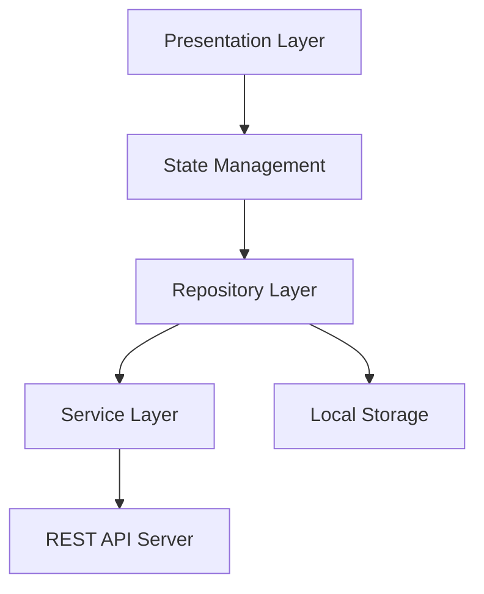
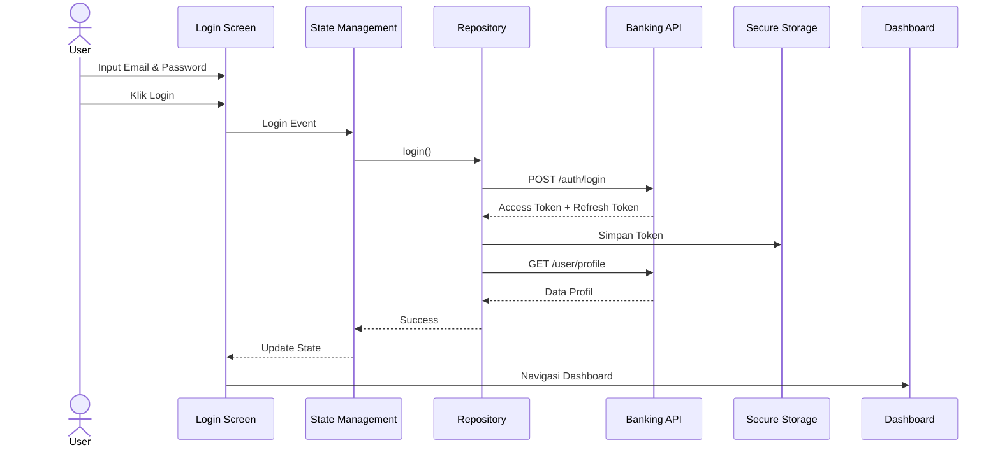

# banking# 🚀 Strategi dan Pola Integrasi REST API pada Aplikasi Mobile Skala Produksi


## 📖 Deskripsi

Dokumentasi ini dibuat sebagai tugas analisis **Strategi dan Pola Integrasi REST API pada Aplikasi Mobile Skala Produksi** menggunakan Flutter.

Topik yang dibahas meliputi:

- Repository Pattern
- Service Layer
- Authentication JWT
- State Management
- Offline-First Architecture
- Error Handling
- API Integration Flow

---

# 📚 1. Arsitektur Integrasi API

Dalam aplikasi Flutter skala produksi, integrasi API sebaiknya dipisahkan menjadi beberapa lapisan (layer) agar kode lebih mudah dipelihara, diuji, dan dikembangkan.

## 🏗️ Diagram Arsitektur



---

## 📌 Layer 1 - Presentation Layer

### Tanggung Jawab

- Menampilkan UI kepada pengguna
- Menangani input pengguna
- Mengirim event ke State Management

### Package Flutter

| Package | Fungsi |
|----------|----------|
| flutter | UI Framework |
| material | Material Design Components |

### Contoh Komponen

- Scaffold
- AppBar
- TextField
- ElevatedButton
- ListView

---

## 📌 Layer 2 - State Management Layer

### Tanggung Jawab

- Mengelola state aplikasi
- Menangani Loading, Success, Error, Empty
- Menjembatani UI dengan Repository

### Package Flutter

| Package | Fungsi |
|----------|----------|
| flutter_bloc | State Management |
| provider | Dependency Injection |
| riverpod | Reactive State Management |

### State Yang Ditangani

```text
Initial
Loading
Success
Error
Empty
Refreshing
```

---

## 📌 Layer 3 - Repository Layer

### Tanggung Jawab

- Menjadi penghubung antara UI dan Data Source
- Menentukan sumber data (API atau Cache)
- Menyembunyikan detail implementasi API

### Package Flutter

| Package | Fungsi |
|----------|----------|
| dio | HTTP Request |
| retrofit | API Generator |

---

## 📌 Layer 4 - Service Layer

### Tanggung Jawab

- Mengelola komunikasi REST API
- Konfigurasi HTTP Client
- Menambahkan Interceptor
- Mengatur Timeout

### Package Flutter

| Package | Fungsi |
|----------|----------|
| dio | HTTP Client |
| retrofit | API Service |
| json_serializable | JSON Parsing |

---

## 📌 Layer 5 - Local Storage Layer

### Tanggung Jawab

- Menyimpan cache data
- Menyimpan token autentikasi
- Mendukung offline mode

### Package Flutter

| Package | Fungsi |
|----------|----------|
| hive | Database Lokal |
| hive_flutter | Integrasi Hive |
| flutter_secure_storage | Penyimpanan Token |
| shared_preferences | Penyimpanan Sederhana |

---

## 📌 Layer 6 - Security & Network Layer

### Tanggung Jawab

- Menambahkan JWT Token
- Refresh Token Otomatis
- Retry Request
- Error Handling

### Package Flutter

| Package | Fungsi |
|----------|----------|
| dio | Interceptor |
| connectivity_plus | Monitoring Internet |
| flutter_secure_storage | Token Storage |

---

# 🏦 2. Skenario Login ke Aplikasi Banking

## Diagram Alur Login



---

## 🔄 Langkah Teknis Login

| No | Proses | Komponen |
|-----|---------|-----------|
| 1 | User membuka aplikasi | LoginScreen |
| 2 | User mengisi email dan password | TextField |
| 3 | User klik tombol Login | ElevatedButton |
| 4 | Validasi form dilakukan | Form Validation |
| 5 | State berubah menjadi Loading | Bloc/Provider |
| 6 | Repository memanggil AuthService | Repository |
| 7 | Dio mengirim POST /auth/login | Dio |
| 8 | Server memverifikasi akun | Backend API |
| 9 | Server mengembalikan JWT Token | REST API |
| 10 | Token disimpan | Flutter Secure Storage |
| 11 | Request profil pengguna dikirim | GET /profile |
| 12 | Dio menambahkan Authorization Header | Interceptor |
| 13 | Data profil diterima | JSON Response |
| 14 | State berubah menjadi Success | Bloc/Provider |
| 15 | Dashboard ditampilkan | Dashboard Screen |

---

## 🔐 Penyimpanan Lokal

### Access Token

```json
{
  "access_token": "eyJhbGciOiJIUzI1Ni..."
}
```

### Refresh Token

```json
{
  "refresh_token": "eyJhbGciOiJIUzI1Ni..."
}
```

Disimpan menggunakan:

```dart
FlutterSecureStorage
```

---

# 📚 3. Roadmap Pembelajaran Integrasi API

## 🟢 Tingkat Dasar (Basic)

### REST API

- Apa itu REST API
- Endpoint API
- HTTP Method
- Request & Response
- JSON Parsing

### Flutter Networking

- Package HTTP
- Package Dio
- Future & Async Await

### Authentication Dasar

- Login API
- Register API
- JWT Dasar

---

## 🟡 Tingkat Menengah (Intermediate)

### Repository Pattern

- Repository Interface
- Repository Implementation
- Remote Data Source
- Local Data Source

### State Management

- Provider
- Riverpod
- Bloc

### Local Storage

- SharedPreferences
- Hive
- Secure Storage

### Error Handling

- Try Catch
- DioException
- Retry Request

### Authentication

- JWT Access Token
- Refresh Token
- Auto Login

---

## 🔴 Tingkat Lanjutan (Advanced)

### Offline First Architecture

- Cache First
- Network First
- Cache Only
- Network Only
- Stale While Revalidate

### Security

- OAuth 2.0
- Certificate Pinning
- Secure Storage
- API Security

### Optimasi Performa

- Pagination
- Infinite Scroll
- Lazy Loading

### Reliability Engineering

- Exponential Backoff
- Retry Strategy
- Circuit Breaker Pattern

### Monitoring

- Firebase Crashlytics
- Sentry
- Analytics

### Production Architecture

- Clean Architecture
- Repository Pattern
- API Gateway
- Microservices

---

# 🎯 Kesimpulan

Integrasi REST API pada aplikasi Flutter skala produksi memerlukan arsitektur yang terstruktur agar aplikasi mudah dikembangkan, aman, dan memiliki performa yang baik.

Penerapan:

✅ Repository Pattern  
✅ Service Layer  
✅ JWT Authentication  
✅ State Management  
✅ Offline First Architecture  
✅ Error Handling  
✅ Caching Strategy  

akan menghasilkan aplikasi yang lebih stabil, scalable, dan siap digunakan pada lingkungan produksi.

---

## 👨‍💻 Author

**Nama:** (Isi Nama Anda)  
**NIM:** (Isi NIM Anda)  
**Mata Kuliah:** Mobile Programming Lanjutan  
**Topik:** Strategi dan Pola Integrasi REST API pada Aplikasi Mobile Skala Produksi
